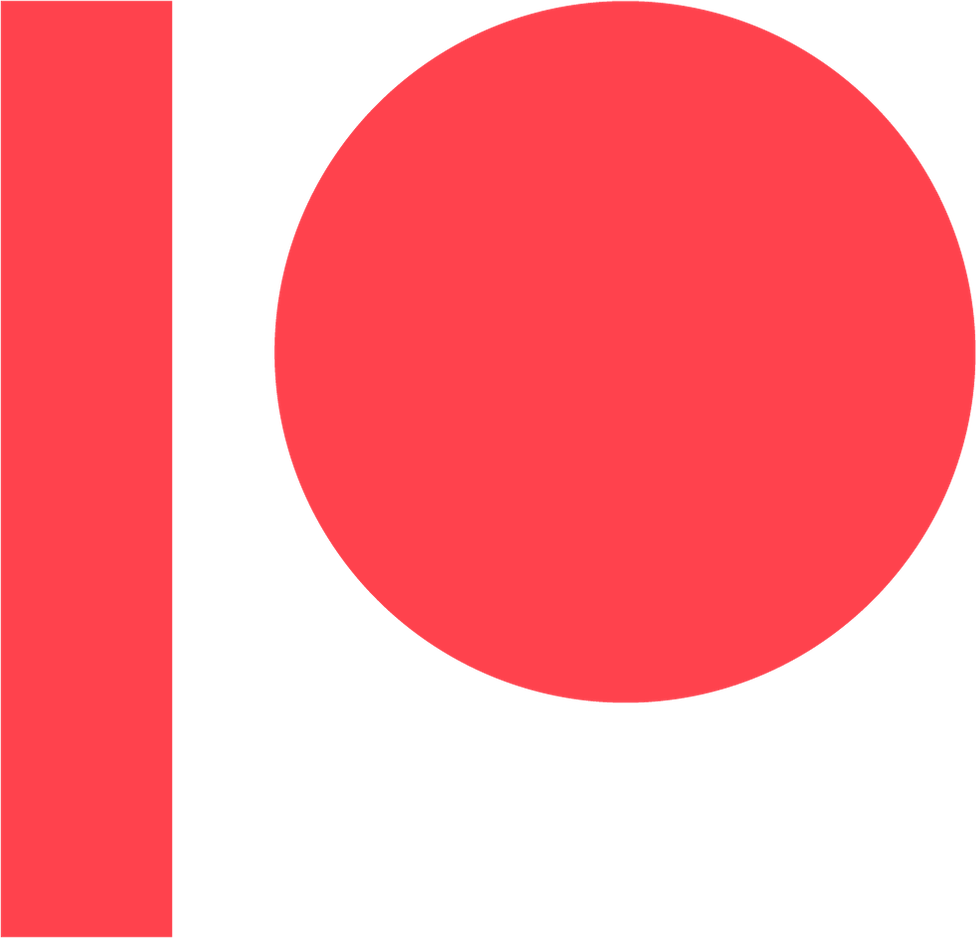

    <a href="https://radiantguild.com">
        </img>
    </a>

---

    <a href="https://rad.gd/discord"></img></a>
    <a href="https://rad.gd/patreon"></img></a>

# Who are we
We are a group of developers (And artists) who are trying to make a change in the commonly followed trend that most if not all art platforms that try to be an alternative to Deviant Art. Ironically we are following the trend but hopfully break the trend where we shut down after a year or two.

# Our history
We started out in 2019 with a site to index all the comics that moved when SmackJeeves had their spectacular fall from grace, followed by their closure in 2020 (Rest in peace). The site has been live since 2019 but we have been working on redoing the whole thing and make a platform out of it rather than an index. We are currently focusing on comics but plan to expand beyond comics!

# Our mission is simple
We strive to be the best we can and will make the following promises.
- We will create a platform for artistic creators to share their content.
- The site needs to be intuitive and interactive.
- The interface will eventually have translations for other languages to help people who are not fluent with english.
- No advertising, The platform is the product, not you.
- All paid features are premium because it costs us more to host.
- All features should be where possible freely accessible without any subscriptions.
- No NFTs *ever*. They are hurting artists and the environment and want no part of them.

# Our other projects
While we are making The Radiant Guild, we are also making a few open source software projects. They include.

## RadiantPM (Radiant Package Manager)
  
A modular and extendable package manager. Our aim was to make our own nuget and NPM feed because we love to host as much as possible ourselves.

## [CRPML (Create RadiantPM Library)](https://github.com/RadiantGuild/Tools.CRPML)
  
CRPML is an extremely configurable project initialiser (think `create-react-app` but you control all the templates).